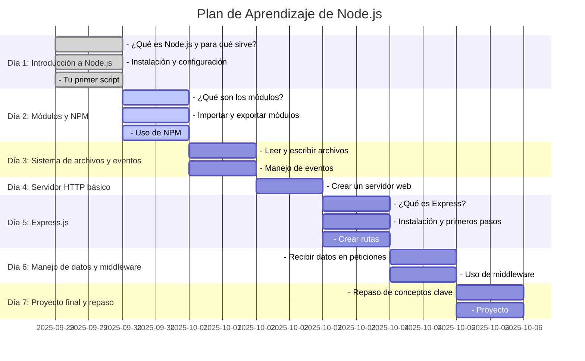

```mermaid
gantt
    title Plan de Aprendizaje de Node.js
    dateFormat  YYYY-MM-DD
    section Día 1: Introducción a Node.js
    - ¿Qué es Node.js y para qué sirve? :done,    a1, 2025-09-29, 0.5d
    - Instalación y configuración :done,    a2, 2025-09-29, 0.5d
    - Tu primer script :done,    a3, 2025-09-29, 1d
    section Día 2: Módulos y NPM
    - ¿Qué son los módulos? :active,  b1, 2025-09-30, 0.5d
    - Importar y exportar módulos :active,  b2, 2025-09-30, 0.5d
    - Uso de NPM :active,  b3, 2025-09-30, 1d
    section Día 3: Sistema de archivos y eventos
    - Leer y escribir archivos :         c1, 2025-10-01, 1d
    - Manejo de eventos :         c2, 2025-10-01, 1d
    section Día 4: Servidor HTTP básico
    - Crear un servidor web :         d1, 2025-10-02, 1d
    section Día 5: Express.js
    - ¿Qué es Express? :         e1, 2025-10-03, 0.5d
    - Instalación y primeros pasos :         e2, 2025-10-03, 0.5d
    - Crear rutas :         e3, 2025-10-03, 1d
    section Día 6: Manejo de datos y middleware
    - Recibir datos en peticiones :         f1, 2025-10-04, 1d
    - Uso de middleware :         f2, 2025-10-04, 1d
    section Día 7: Proyecto final y repaso
    - Repaso de conceptos clave :         g1, 2025-10-05, 1d
    - Proyecto: pequeña API :         g2, 2025-10-05, 1d
```
